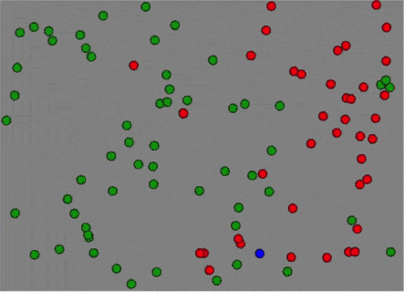

# Table of contents
* [General info](#general info)
* [Navigation](#navigation)
* [Sliders](#sliders)
* [Technologies](#technologies)
* [Setup](#setup)

---

# General info
I'm presenting to you a virus spread simulation in which you have a couple of small options to choose, that will have 
impact on the simulation. Dots on presentation below represents people moving through pane. Green dots
represents healthy people, red sick, blue cure and black deceased.

---

#Navigation
To navigate through the simulation I prepared a few buttons and sliders. Beginning from most important buttons there are:
* Start button - start the simulation
* Stop button - freeze action. When pressing 'start' after 'stop' button,
it will resume present simulation
* Reset button - resets and whole presentation along with the timer which indicates the time 
passed after start on each iteration
* Exit button - will simply close window and end process and also will save crucial data to project folder as text file.

---

#Sliders
Additional there are few sliders to apply small changes to simulation. Moving from top to bottom, there are:
* People size - changes the size of each person drawn on pane
* Group size - changes the amount of people being drawn on screen. Actual group size change every press of Reset button
* Movement speed - changes the moving speed of each person 
* Sick time - the time after which each person (after getting sick) obtain "cured" or "deceased" status
* Death rate - there is a chance that person after getting sick (after sick time passed) will get "deceased" status which
will be indicated by black, not moving dot. Calculation here is based on Math.Random function. 

---

# Technologies
Project is created with:
* IntelliJ IDEA version: 2020.2.3 x64
* JUnit Jupiter Engine version: 5.6.2
* JUnit Jupiter API version: 5.6.2
* Mockito JUnit Jupiter version: 3.3.3
* Gradle version: 6.7.1
* Gluon version: 2.8.4
* JavaFX version: 11.0.2

---

# Setup
To run application use "run" button from Gradle tab.

